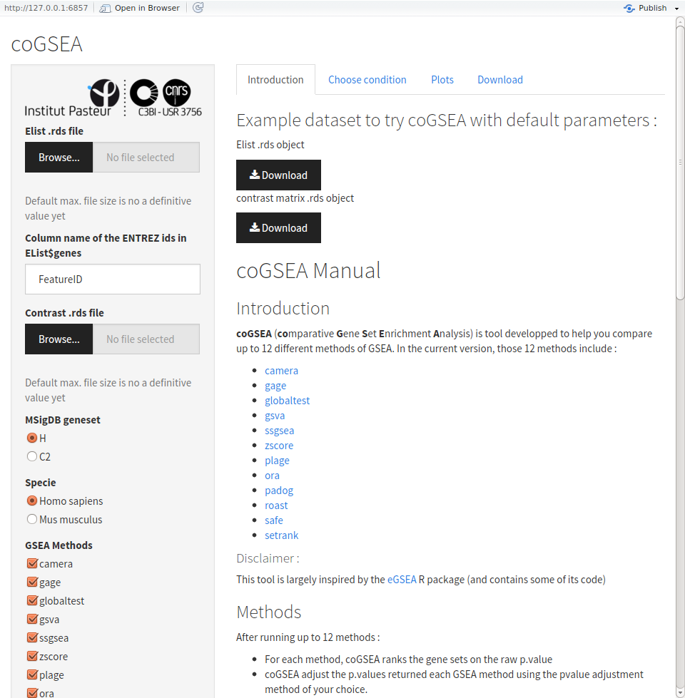

# coGSEA Shiny

**co**mparative **G**ene **S**et **E**nrichment **Analysis**

## Requirements

- [shiny](https://cran.r-project.org/web/packages/shiny/index.html)      
- [shinythemes](https://cran.r-project.org/web/packages/shinythemes/index.html)
- [coGSEA](https://gitlab.pasteur.fr/mborry/coGSEA)

## How to run the shiny app

```
git clone https://mborry@gitlab.pasteur.fr/mborry/coGSEA_shiny.git
cd coGSEA_shiny
rstudio ui.R
```
**-> "Run app"**

## Input files

All object are loaded as [.rds](https://stat.ethz.ch/R-manual/R-devel/library/base/html/readRDS.html) binary files.  

Two objects are used as an input to this method :   

- An [elist](http://web.mit.edu/~r/current/arch/i386_linux26/lib/R/library/limma/html/EList.html) object. This object is very similar to a R list. [Example data file](./exampleData/elist.rds)
- A contrast matrix. [Example data](./exampleData/contrast.rds)

More information about the method can be found in the [method introduction](./intro.md)


#### Disclaimer :
This tool is largely inspired by the [eGSEA](http://bioconductor.org/packages/release/bioc/html/EGSEA.html) R package (and contains some of its code)
